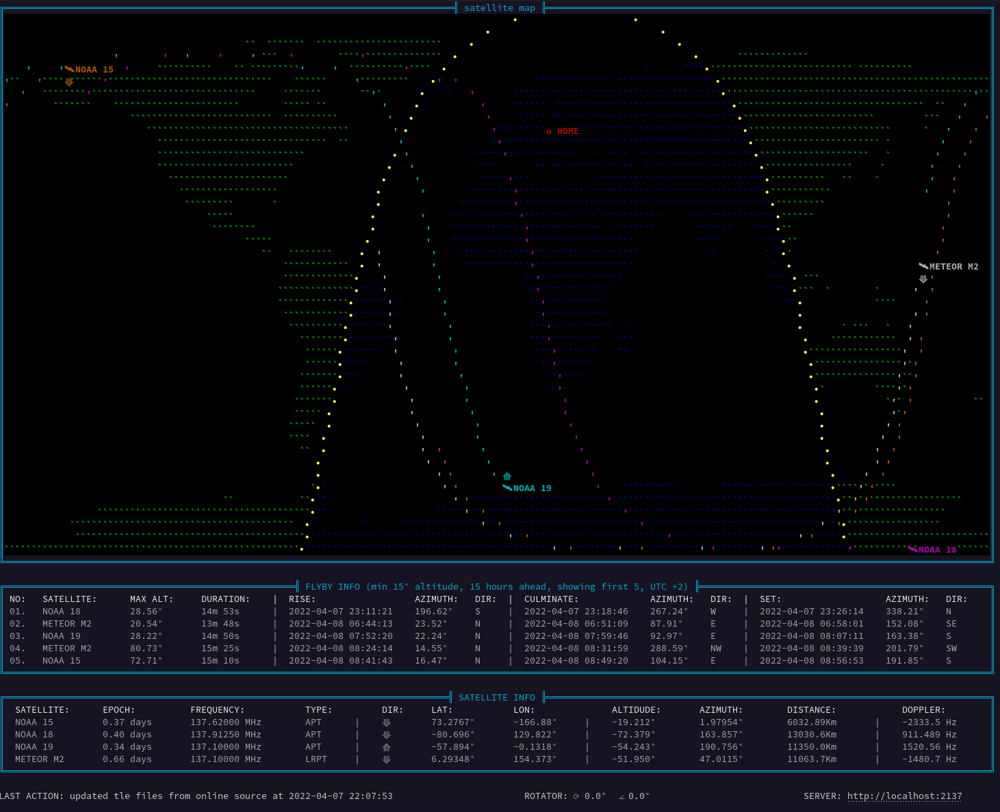
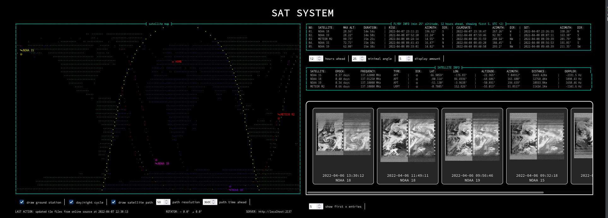

# SAT SYSTEM

<p align="center">


</p>

---

## DESCRIPTION
SAT SYSTEM is a tool for automatic satellite tracking and image decoding

- the program runs without any GUI and can be run in CLI without any desktop environment

- it is capable of automatically tracking the position of satellites on the map, starting the SDR receiver and decoding the data and converting them into a photo

- SAT SYSTEM is very highly configurable to adapt to different needs. to change the behavior of the program just edit the setupjson file

- program itself can download TLE files from the NORAD website without outside interference

- program has api and rotator support

- APT and LRPT protocol supported (HRPT coming soon)

---

## INSTALATION

1.  install meteor_demod

```console
git clone https://github.com/dbdexter-dev/meteor_demod
cd meteor_demod
mkdir build && cd build
cmake ..
make
sudo make install
```
2.  install meteor_decode

```console
git clone https://github.com/dbdexter-dev/meteor_decode
cd meteor_decode
mkdir build && cd build
cmake ..
make
sudo make install
```
3.  install noaa-apt
```console
https://github.com/martinber/noaa-apt/releases
```

4. install rtl-sdr (you may need to change some system config files) (refer to offcial install guide)
```console
sudo apt install rtl-sdr
```

5. clone this repo
```console
git clone https://github.com/wojlin/SAT_SYSTEM
cd SAT_SYSTEM
pip install -r requirements.txt
```
6. edit config files to your needs

7. to start promgram move to SAT_SYSTEM directory and run command:
```console
python3 main.py
```

---

## CONFIG CONFIGURATION

config file is located in config/setup.json

```javascript
{
  "write_log": true,  //  <bool> if set to true, it will generate a log with information about what is happening at the current moment, the error report will also appear there
  "ground_station": {
    "lat": 54.0  // <float> lat position in degrees of radio receiver location
    "lon": 18.0 // <float> lon position in degrees of radio receiver location
  },
  "tle_update": {
    "update": true, // <bool> if set to true, the program will automatically download TLE files from the NORAD website
    "update_interval": 3600 //  <float> how often files will be downloaded from the norad website in seconds (most NOAA satellites are updated once a day, so it is recommended to set this variable to a high value)
  },
  "console_update": {
    "map": 70, //  <float> how often map will update on terminal (this function cost lot of memory so i suggest to set it to more than 30 seconds)
    "flyby": 60, //  <float>how often flyby table will update (in seconds)
    "info": 1, // <float> hot often info box will update (in seconds)
    "status": 0.5 //  <float> how often status will update (in seconds)
  },
  "api_settings": {
    "use_api": true, // <bool> self-explanatory
    "host": "localhost", // <string> hostname or ip address of host
    "port": 2137 // <int> port of host
  },
  "decode_settings": {
    "decode": true, // <bool> if set to true program will comunicate with SDR and try to decode image otherwise program will be only working as satellite tracker/flyby predictor
    "use_rotator": true, // <bool> if set to true program will open tcp port ans send satellite azimuth and elevation data
    "rotator_host": "localhost",  // <string> hostname or ip address of host
    "rotator_port": 2138, // <int> port of host
    "delete_temp_files": true, // <bool> if set to true, the program will delete temporary files created when decoding the signal (it is recommended to leave it true as temporary files for LRPT can be as large as several GB)
    "decode_temp_path": "temp", // <string> path to the directory where temporary files are to be created
    "output_dir_path": "output",  // <string> path to the directory where the output files will be created
    "write_metadata": true // <bool> if set to true the program will log useful information about various parameters. (NOTE !!!: the location of the base station will be saved in the metadata, which can be potentially dangerous)
  },
  "drawing_settings": {
    "map_config": {
      "draw_ground_station": true, // <bool> if set to true, the location of the base station will be marked on the map
      "draw_day_night_cycle": true, // <bool> if set to true, the day / night division will be drawn on the map
      "draw_satellite_path": true, // <bool> if set to true, a path will be drawn along which the satellites move
      "satellite_path_resolution": 50, // <int> number of points for a single satellite path
      "satellite_path_time_ahead": // 3600 <int> value in seconds how far in time the path should be drawn
    },
    "flyby_config": {
      "hours_ahead": 15, // <int> how far in time will the script look for potential passages (in hours)
      "minimal_angle": 15, //  <int> the minimum angle of flight of the satellite relative to the base station, according to which the script determines that it is worth receiving the image
      "display_amount": 5 // <int> how many passages will be shown in the table
    },
    "chars": {
      "upper_left_corner": "╔", // <string> border char
      "upper_right_corner": "╗",  // <string> border char
      "lower_left_corner": "╚",  // <string> border char
      "lower_right_corner": "╝",  // <string> border char
      "vertical_line": "║",  // <string> border char
      "horizontal_line": "═",  // <string> border char
      "left_opener": "╣",  // <string> border char
      "right_opener": "╠",  // <string> border char
      "arrow_up": "⟰",  // <string> satellite flight direction north
      "arrow_down": "⟱", // <string> satellite flight direction south
      "sunset": "\uD83D\uDF84", // <string> terminator char
      "satellite": "\uD83D\uDEF0", // <string> satellite icon char
      "ground_station": "o",  // <string> base station icon char
      "ground_station_name": "HOME"  // <string> name of base station
    },
    "ansi": {
      "ground_station_color": "[1;31;40m", // <string> color in ansi
      "border_color": "[38;5;38m", // <string> color in ansi
      "earth_color": "[1;32;40m", // <string> color in ansi
      "earth_color_night": "[1;34;40m", // <string> color in ansi
      "earth_color_sunset": "[1;93;40m", // <string> color in ansi
      "text_color": "[38;5;7m", // <string> color in ansi
      "info_color": "[38;5;255m", // <string> color in ansi
      "end_color": "[0m", // <string> end color in ansi
      "sat_colors": [ // icon colors and satlelite paths in ansi (you can add more colors to this list if you need)
        "[1;33;40m",
        "[1;35;40m",
        "[1;36;40m",
        "[1;37;40m"
      ]
    },
    "html": {
      "ground_station_color": "#ff0000", // <string> color in hex
      "border_color": "#00ffe5",  // <string> color in hex
      "earth_color": "#46f23a",  // <string> color in hex
      "earth_color_night": "#3a71f2",  // <string> color in hex
      "earth_color_sunset": "#fff200",  // <string> color in hex
      "text_color": "#ababab",  // <string> color in hex
      "info_color": "#ffffff",  // <string> color in hex
      "end_color": "#ffffff",  // <string> end color in hex
      "sat_colors": [ // icon colors and satlelite paths in hex (you can add more colors to this list if you need)
        "#ffff00",
        "#9000ff",
        "#ff00ea",
        "#ff0000"
      ]
    }
  }
}
```

---

## TLE CONFIG CONFIGURATION

tle config file is located in config/tle.json

```javascript
{
    "NOAA 15": {  // sat name
        "line1": "1 25338U 98030A   22099.59292804  .00000140  00000+0  76876-4 0  9994", // <str> line1 of tle file
        "line2": "2 25338  98.6521 130.0047 0011296 134.6133 225.5971 14.26106341243456", // <str> line2 of tle file
        "freq": 137.62, // <float> satellite downlink frequency in MHz
        "type": "APT", // <string> modulation type. currently only APT and LRTP is supported (HRTP support coming soon)
        "catalog_number": "25338" // <string> satellite catalog number in NORAD standard (necessary to update the TLE)
    }
}
```

---

## TO DO

- dynamic resizable "GUI" to fit depending on terminal size
- implement doppler shift to signal demodulation
- implement HRPT signal decoding
- optimalization